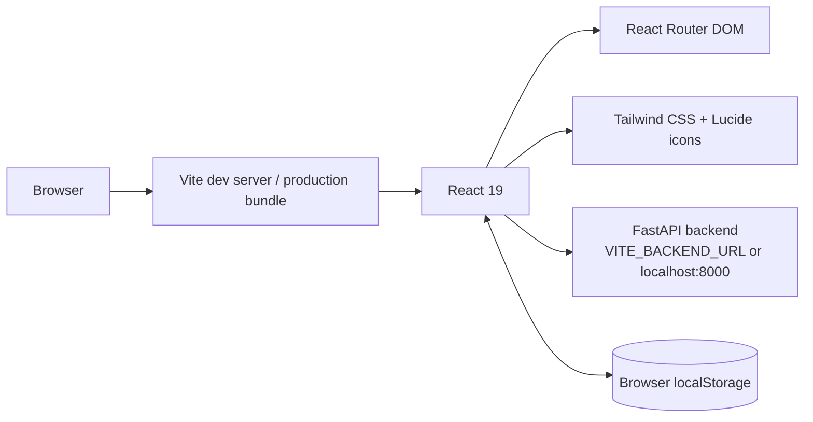
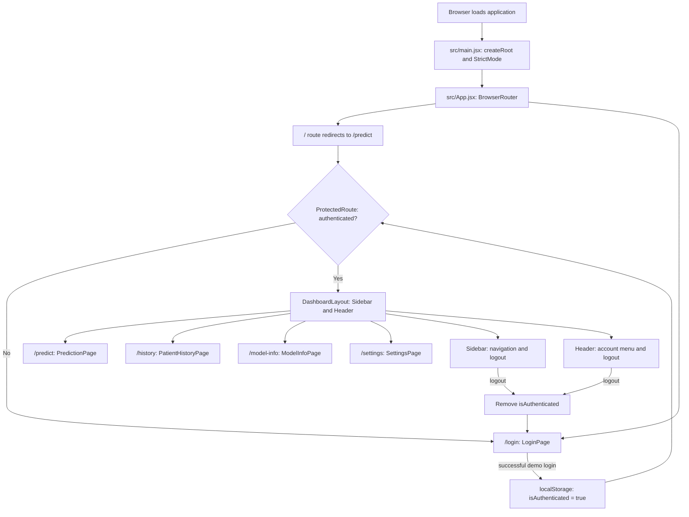
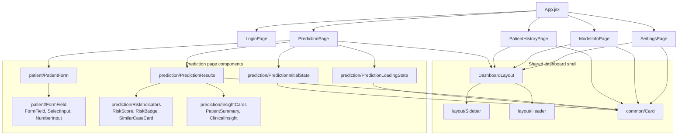
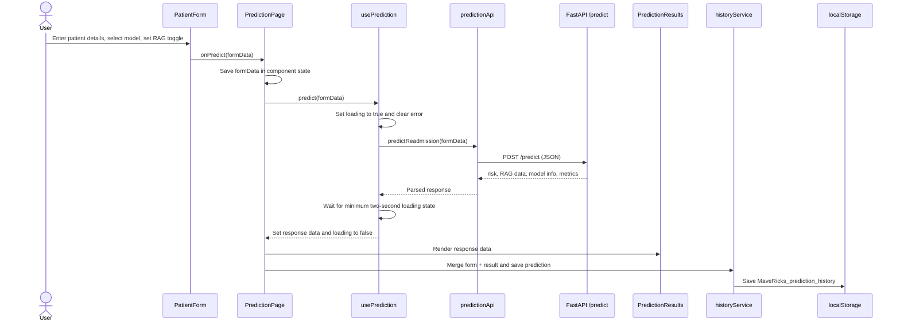
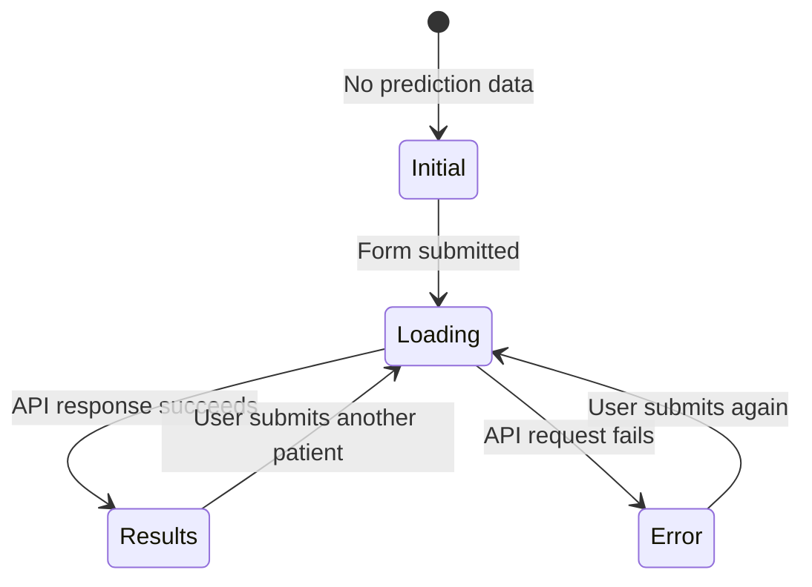
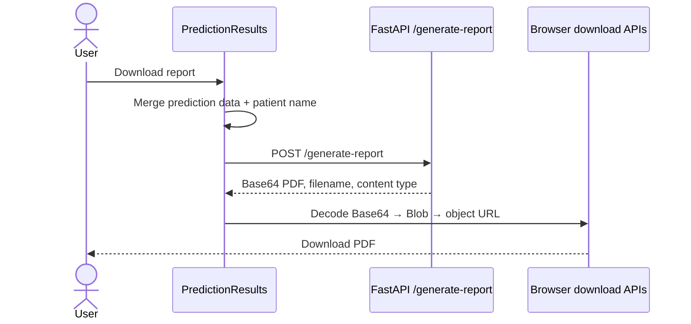
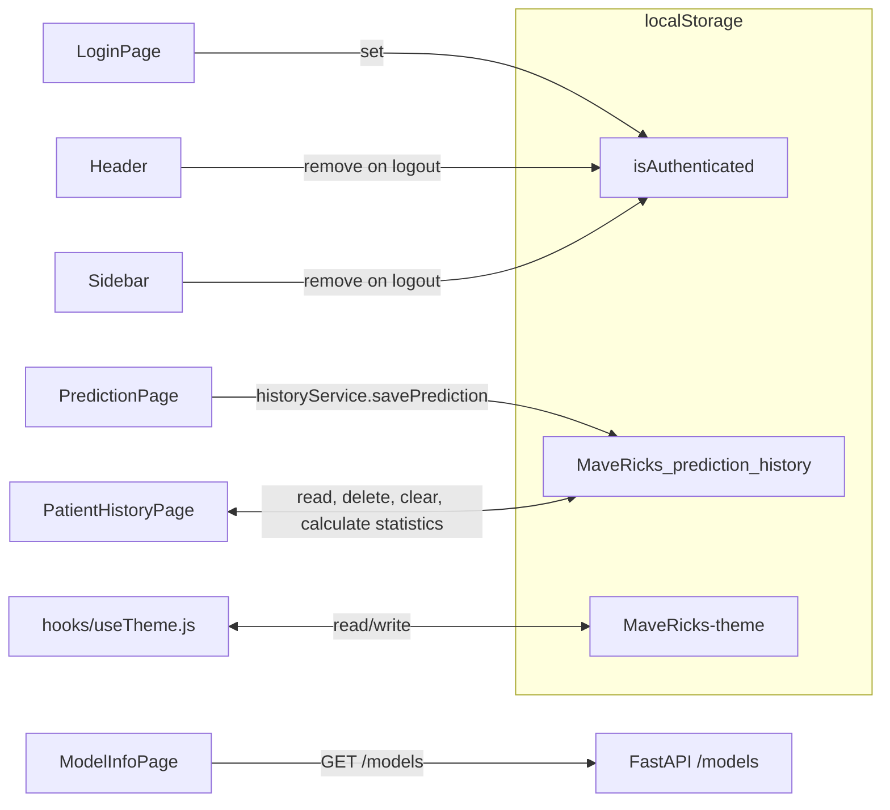

# Frontend Architecture

This document describes the current React/Vite frontend and every application-level connection it makes: routing, layout composition, state, browser storage, and API calls.

## 1. Technology and runtime boundary



- `src/main.jsx` mounts React in `#root` using `StrictMode`.
- `src/App.jsx` owns client-side routes and route protection.
- The backend base URL is `VITE_BACKEND_URL`; when unset it defaults to `http://localhost:8000`.
- There is no frontend database or global state library. Page and hook state are held in React; persistent client data is held in `localStorage`.

---

## 2. Application shell, routing, and access control



### Access-control note

`ProtectedRoute` is a UI guard, not server-side authentication. It checks only the `isAuthenticated` browser key. The API itself does not receive or validate an authentication token.

---

## 3. Component architecture



---

## 4. Core prediction flow



### Request contract

`PatientForm` sends the following to `POST /predict` through `src/services/predictionApi.js`:

```text
age, gender, diag_1, time_in_hospital,
num_lab_procedures, num_procedures,
n_inpatient, n_emergency, n_outpatient,
num_medications, number_diagnoses, insulin,
model_type, use_rag
```

### Response contract used by the UI

```text
risk_probability
is_high_risk
similar_case_readmit_rate
summary
model_used
rag_enabled
model_metrics { auc_roc, f1_score, precision, recall, ... }
```

### Rendering states



`PredictionPage` renders `PredictionInitialState`, `PredictionLoadingState`, `PredictionResults`, or an error message based on the state exposed by `usePrediction`.

---

## 5. Report-download flow



The PDF is generated by the backend; the frontend only sends the result data, decodes the returned Base64 payload, and triggers a browser download.

---

## 6. History, settings, and model-information flows



### Important implementation observations

- Prediction history is stored only in the current browser. It is not shared between users or devices and can be removed by clearing site data.
- Login is currently a demo client-side flow with hard-coded credentials and no backend session.
- `useTheme.js` defines `ThemeProvider` and `useTheme`, but `ThemeProvider` is not currently mounted in `main.jsx`; it is available for future integration rather than active application-wide theme state.
- Model Information independently requests `GET /models`; it does not reuse prediction-page state.
- Settings are currently UI/profile preferences; they do not have an API persistence connection.

---

## 7. Folder structure and ownership

```text
src/
├── main.jsx                         # React entry point; mounts App
├── App.jsx                          # Router and ProtectedRoute guard
├── index.css                        # Global styles and Tailwind entry
├── App.css                          # Additional application styles
│
├── pages/                           # Route-level screens
│   ├── LoginPage.jsx                # Demo sign-in and local auth flag
│   ├── PredictionPage.jsx           # Prediction orchestration and history save
│   ├── PatientHistoryPage.jsx       # History list, details, deletion, statistics
│   ├── ModelInfoPage.jsx            # GET /models and metrics presentation
│   └── SettingsPage.jsx             # User preference/settings UI
│
├── components/
│   ├── common/
│   │   └── Card.jsx                 # Shared display container
│   ├── layout/
│   │   ├── DashboardLayout.jsx      # Shared header/sidebar/page shell
│   │   ├── Sidebar.jsx              # Navigation and logout
│   │   └── Header.jsx               # User menu and logout
│   ├── patient/
│   │   ├── PatientForm.jsx          # Patient input and model/RAG selection
│   │   └── FormField.jsx            # Reusable form controls
│   └── prediction/
│       ├── PredictionInitialState.jsx # Empty-state guidance
│       ├── PredictionLoadingState.jsx # Loading experience
│       ├── PredictionResults.jsx      # Result, metrics, PDF download
│       ├── RiskIndicators.jsx         # Risk score, badge, similar cases
│       └── InsightCards.jsx           # Summary and clinical guidance
│
├── hooks/
│   ├── usePrediction.js             # Prediction request/loading/error/data state
│   └── useTheme.js                  # Available theme context and persistence
│
├── services/
│   ├── predictionApi.js             # POST /predict API boundary
│   └── historyService.js            # localStorage CRUD and history statistics
│
└── assets/                          # Images and branding assets
```

---

## 8. Connection rules for future changes

| If changing… | Update these frontend areas |
| --- | --- |
| Patient input fields | `PatientForm.jsx`, API request schema, backend `PatientInput`, and possibly the history-details view. |
| Prediction response fields | `PredictionResponse`, `PredictionResults.jsx`, `PredictionPage.jsx`, and `PatientHistoryPage.jsx`. |
| Supported models/RAG variants | `PatientForm.jsx` selector/toggle, backend `/predict`, backend `/models`, and `ModelInfoPage.jsx`. |
| Model metric format | Backend `/models`, prediction response `model_metrics`, `ModelInfoPage.jsx`, `PredictionResults.jsx`, and history detail rendering. |
| Authentication | `LoginPage.jsx`, `ProtectedRoute` in `App.jsx`, `Header.jsx`, `Sidebar.jsx`, plus a backend authentication design. |
| History persistence | `historyService.js` and `PatientHistoryPage.jsx`; replace localStorage with an API service if shared/server-side history is required. |
| Theme support | Mount `ThemeProvider` in `main.jsx`, then use `useTheme()` from theme-aware components. |

## 9. Team takeaway

The frontend is organised around a clean separation of concerns:

```text
Pages coordinate user journeys
    → components render focused UI
    → hooks own temporary request state
    → services own API/localStorage boundaries
    → backend owns prediction, metrics, and PDF generation
```

For the remediation work described in `REPORT.md`, the existing user journey does not need new routes or a major component rewrite. The central change is ensuring the backend returns the model artifact and metrics that correctly match the existing `model_type` and `use_rag` controls.
